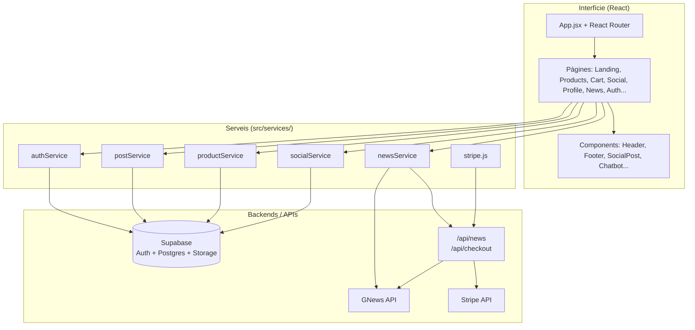
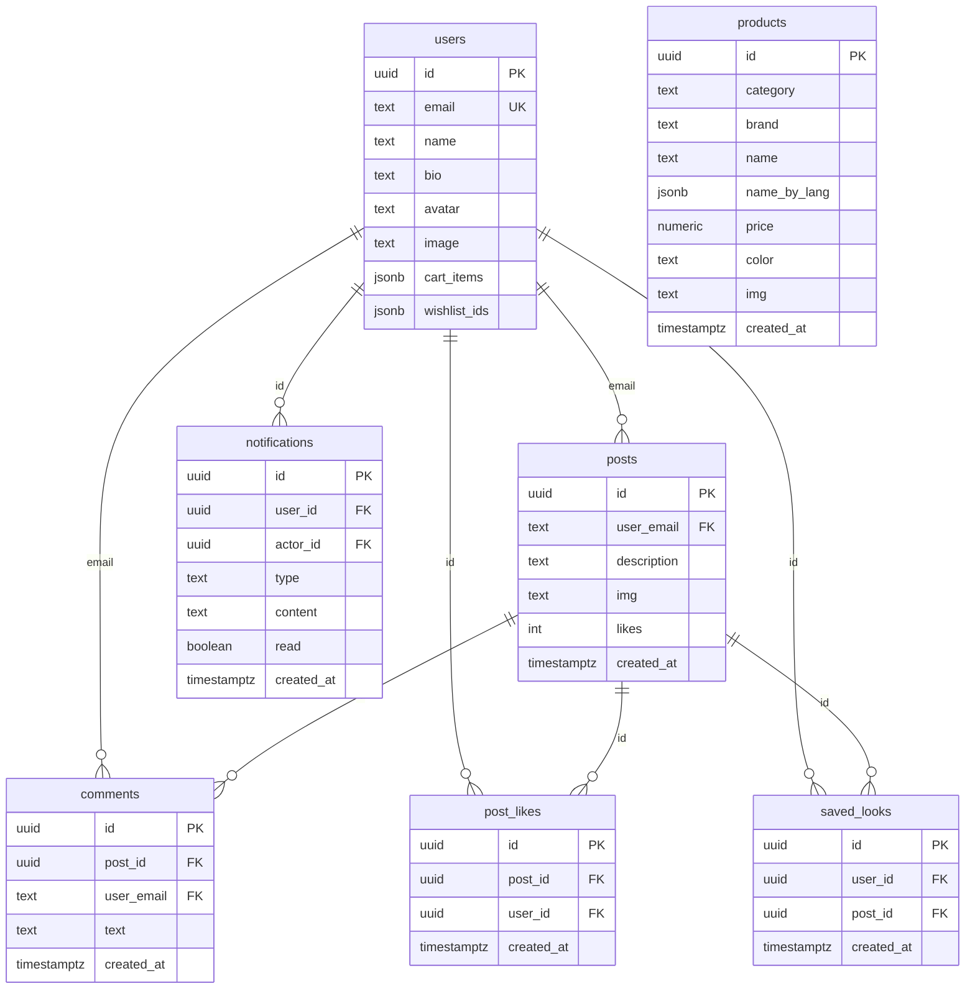
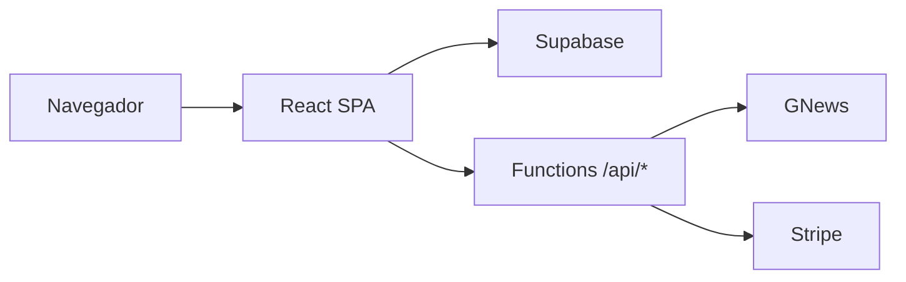

# Proyecto Final: Plataforma de Moda y Red Social (ROB THE FAB)

Repositorio del proyecto desarrollado por **Robin** y **Fabio**: aplicación web híbrida que combina **e-commerce de moda**, **feed social**, **noticias** y **asistente (chatbot)**.

---

## Funcionalitat

La plataforma resol la fragmentació entre inspiració i compra: l’usuari pot explorar el catàleg, desar el carret, veure publicacions amb text o imatge, fer *like*, comentar, guardar *looks*, veure perfils públics, llegir notícies de moda (API externa) i usar el xatbot d’ajuda. L’accés a la part social (feed, perfil, guardats) requereix sessió; la botiga i la landing poden explorar-se sense compte (segons configuració de rutes).

**Mòduls principals**

* **E-commerce:** catàleg per categories, detall de producte, carret i *wishlist* (persistència local al navegador).
* **Red social:** creació de posts (text i/o imatge pujada a emmagatzematge), feed amb filtres, perfils, *likes*, comentaris i *looks* guardats a base de dades.
* **Notícies:** consum de titulars via **GNews** (local amb clau o producció via funció serverless per evitar CORS).
* **Passarel·la de pagament (opcional):** integració **Stripe** (sessió de *checkout*) des de ruta serverless.
* **Chatbot:** respostes contextuals sobre pàgina actual, carret i comptadors.

---

## 3. Mockup gráfico

<p align="center">
  
  
  
</p>

<p align="center">
  
  
  
</p>

<p align="center">
   
   
   
</p>

<p align="center">
   
   
   
</p>

<p align="center">
   
   
   
   
</p>

<p align="center">
  
  
  
</p>

<p align="center">
  
  
  
</p>

<p align="center">
  
  
  
</p>

---

## Diagrames UML (codi)

Vista simplificada de capes i dependències del **frontend React**. Els serveis encapsulen la lògica d’accés a dades; `App.jsx` centralitza estat i rutes.



---

## Diagrames ER (bbdd)

Esquema **real** del projecte Supabase (PostgreSQL, esquema `public`). El bloc SQL següent és **només documentació** (export de context; l’ordre de creació pot caldre ajustar-lo si es vol executar des de zero).

### Relacions (diagrama ER)



*(Les notificacions tenen **dues** FK cap a `users`: `user_id` destinatari i `actor_id` qui genera l’esdeveniment; al diagrama es resumeix amb una sola aresta cap a `users`.)*

### Llista de taules

| Taula | Funció |
|--------|--------|
| **users** | Perfil públic vinculat a `auth.users` (`id` = mateix UUID). Camps addicionals al DDL: `image`, `follower_handles`, `following_handles`, `saved_post_ids`, `preferred_language`, `preferred_theme`, `cart_items`, `wishlist_ids`. El front també persisteix carret / wishlist a `localStorage`. |
| **posts** | Publicacions del feed (`description`, `img`, `likes`, `user_email`). |
| **comments** | Comentaris d’un post; `user_email` referencia `users(email)`. |
| **post_likes** | Un registre per cada *like* (`post_id`, `user_id`). |
| **saved_looks** | Looks guardats (`user_id` → `users`, `post_id` → `posts`). |
| **notifications** | Notificacions entre usuaris (`type`, `content`, `read`); preparada per a futures funcions al client. |
| **products** | Catàleg de la botiga: `category`, `brand`, `name`, `name_by_lang`, `price`, `color`, `sizes[]`, `img` (sense FK cap a `posts`). |

La taula **products** no està relacionada per clau amb **posts**. Els camps legacy a **users** (`saved_post_ids`, etc.) poden coexistir amb **saved_looks** segons migracions; el codi actual del repo prioritza **`saved_looks`** per als guardats del feed.

<details>
<summary>DDL exportat (referència; no cal executar-lo tal qual)</summary>

```sql
-- WARNING: This schema is for context only and is not meant to be run.
-- Table order and constraints may not be valid for execution.

CREATE TABLE public.comments (
  id uuid NOT NULL DEFAULT uuid_generate_v4(),
  post_id uuid,
  user_email text NOT NULL,
  text text NOT NULL,
  created_at timestamp with time zone NOT NULL DEFAULT timezone('utc'::text, now()),
  CONSTRAINT comments_pkey PRIMARY KEY (id),
  CONSTRAINT comments_user_email_fkey FOREIGN KEY (user_email) REFERENCES public.users(email),
  CONSTRAINT comments_post_id_fkey FOREIGN KEY (post_id) REFERENCES public.posts(id)
);
CREATE TABLE public.notifications (
  id uuid NOT NULL DEFAULT uuid_generate_v4(),
  user_id uuid,
  actor_id uuid,
  type text NOT NULL,
  content text,
  read boolean DEFAULT false,
  created_at timestamp with time zone NOT NULL DEFAULT timezone('utc'::text, now()),
  CONSTRAINT notifications_pkey PRIMARY KEY (id),
  CONSTRAINT notifications_user_id_fkey FOREIGN KEY (user_id) REFERENCES public.users(id),
  CONSTRAINT notifications_actor_id_fkey FOREIGN KEY (actor_id) REFERENCES public.users(id)
);
CREATE TABLE public.post_likes (
  id uuid NOT NULL DEFAULT uuid_generate_v4(),
  post_id uuid,
  user_id uuid,
  created_at timestamp with time zone NOT NULL DEFAULT timezone('utc'::text, now()),
  CONSTRAINT post_likes_pkey PRIMARY KEY (id),
  CONSTRAINT post_likes_post_id_fkey FOREIGN KEY (post_id) REFERENCES public.posts(id),
  CONSTRAINT post_likes_user_id_fkey FOREIGN KEY (user_id) REFERENCES public.users(id)
);
CREATE TABLE public.posts (
  id uuid NOT NULL DEFAULT uuid_generate_v4(),
  user_email text NOT NULL,
  description text NOT NULL,
  img text DEFAULT ''::text,
  likes integer DEFAULT 0,
  created_at timestamp with time zone NOT NULL DEFAULT timezone('utc'::text, now()),
  CONSTRAINT posts_pkey PRIMARY KEY (id),
  CONSTRAINT posts_user_email_fkey FOREIGN KEY (user_email) REFERENCES public.users(email)
);
CREATE TABLE public.products (
  id uuid NOT NULL DEFAULT uuid_generate_v4(),
  category text NOT NULL,
  brand text DEFAULT 'ROB THE FAB'::text,
  name text NOT NULL,
  name_by_lang jsonb NOT NULL DEFAULT '{}'::jsonb,
  price numeric NOT NULL,
  color text,
  sizes ARRAY DEFAULT '{}'::text[],
  img text,
  created_at timestamp with time zone NOT NULL DEFAULT timezone('utc'::text, now()),
  CONSTRAINT products_pkey PRIMARY KEY (id)
);
CREATE TABLE public.saved_looks (
  id uuid NOT NULL DEFAULT uuid_generate_v4(),
  user_id uuid NOT NULL,
  post_id uuid NOT NULL,
  created_at timestamp with time zone NOT NULL DEFAULT timezone('utc'::text, now()),
  CONSTRAINT saved_looks_pkey PRIMARY KEY (id),
  CONSTRAINT saved_looks_user_id_fkey FOREIGN KEY (user_id) REFERENCES public.users(id),
  CONSTRAINT saved_looks_post_id_fkey FOREIGN KEY (post_id) REFERENCES public.posts(id)
);
CREATE TABLE public.users (
  id uuid NOT NULL,
  email text NOT NULL UNIQUE,
  name text NOT NULL,
  bio text DEFAULT ''::text,
  avatar text DEFAULT ''::text,
  image text DEFAULT ''::text,
  follower_handles ARRAY DEFAULT '{}'::text[],
  following_handles ARRAY DEFAULT '{}'::text[],
  created_at timestamp with time zone NOT NULL DEFAULT timezone('utc'::text, now()),
  saved_post_ids ARRAY DEFAULT '{}'::uuid[],
  preferred_language text DEFAULT 'ca'::text,
  preferred_theme text DEFAULT 'light'::text,
  cart_items jsonb DEFAULT '[]'::jsonb,
  wishlist_ids jsonb DEFAULT '[]'::jsonb,
  CONSTRAINT users_pkey PRIMARY KEY (id),
  CONSTRAINT users_id_fkey FOREIGN KEY (id) REFERENCES auth.users(id)
);
```

</details>

---

## Seguretat: Row Level Security (RLS)

La **RLS** es configura al panell de Supabase: **Database → Tables → [taula] → Policies** (o **Authentication** per fluxos d’usuari; les regles són SQL sobre files). El resum següent coincideix amb el projecte **`wdazdicwhgjnnkvqgxqm`** (polítiques visibles al dashboard).

### Resum per taula

| Taula | RLS | Política | Rol | Comanda |
|-------|-----|----------|-----|---------|
| **comments** | Activada | `allow_all` | `public` | `ALL` |
| **notifications** | Activada | `allow_all` | `public` | `ALL` |
| **post_likes** | Activada | `allow_all` | `public` | `ALL` |
| **posts** | Activada | `allow_all_posts` | `public` | `ALL` |
| **posts** | Activada | `Enable insert for authenticated users only` | `authenticated` | `INSERT` |
| **products** | Activada | `Allow public read access` | `public` | `SELECT` |
| **saved_looks** | Activada | `Users can view their own saved looks` | `public` | `SELECT` |
| **saved_looks** | Activada | `Users can insert their own saved looks` | `public` | `INSERT` |
| **saved_looks** | Activada | `Users can delete their own saved looks` | `public` | `DELETE` |
| **users** | Activada | `allow_all` | `public` | `ALL` |
| **users** | Activada | `Users can update their own profile` | `public` | `UPDATE` |

### Notes

* Les polítiques **`allow_all`** (o **`allow_all_posts`**) sobre el rol **`public`** són **molt obertes** per a un entorn real: qualsevol petició amb la clau **anon** pot superar moltes restriccions si no hi ha comprovacions addicionals. Solen usar-se en **fase de desenvolupament**; en producció convé reemplaçar-les per condicions amb `auth.uid()`, rols, etc.
* **`saved_looks`** és on el model és més restrictiu: SELECT / INSERT / DELETE només dels propis registres (segons la definició SQL de cada política al panell).
* **`products`**: accés de lectura pública (`SELECT`), adequat a un catàleg visible sense iniciar sessió.

---

## Emmagatzematge (Storage / buckets)

Els **buckets** es gestionen al panell de Supabase: **Storage → Buckets** (i les polítiques associades a **Storage → Policies** o des de cada bucket → *Policies*, segons la versió de la UI). Afecten la taula interna `storage.objects` (RLS específica de Storage, independent de les taules `public.*`).

### Bucket usat per aquest repositori

| Bucket | Ús al codi | Fitxers / prefixos |
|--------|------------|---------------------|
| **`post-images`** | Imatges de publicacions i avatars d’usuari (mateix bucket per simplicitat) | `posts/<fitxer>` (`postService.js`), `avatars/<fitxer>` (`authService.js`) |

**On es defineix al codi**

* `src/services/postService.js` — `supabase.storage.from('post-images').upload('posts/...')` i `getPublicUrl`.
* `src/services/authService.js` — pujada d’avatar a `post-images` sota la carpeta `avatars/...`.

**URL pública**

Després de la pujada, l’app obté l’URL amb `getPublicUrl` i la desa a `posts.img` o a `users.avatar` (segons el flux).

**Polítiques (RLS de Storage)**

Al dashboard, dins del bucket o a **Storage → Policies**, cal tenir permisos coherents amb l’app (p. ex. lectura pública si el bucket és públic, o `INSERT`/`UPDATE` només per usuaris autenticats per a `avatars/` i `posts/`). **Documenteu aquí** (o amb captures) les polítiques reals del vostre projecte si el tribunal ho demana: nom del bucket no implica seguretat sense regles a `storage.objects`.

---

## Explicació de l’arquitectura

* **Client SPA (Vite + React 18):** una sola pàgina amb **React Router** per URLs (`/shop`, `/social`, `/profile`, etc.). L’estat global del carret, *wishlist*, likes i guardats es gestiona a `App.jsx` i es persisteix en part a `localStorage`.
* **Backend com a servei (BaaS):** **Supabase** (`https://wdazdicwhgjnnkvqgxqm.supabase.co`) ofereix autenticació, base de dades PostgreSQL i **Storage** (bucket `post-images`; vegeu **Emmagatzematge (Storage / buckets)**). El frontend usa el SDK `@supabase/supabase-js` amb URL i clau anon (variables d’entorn `VITE_*`).
* **Funcions serverless (Vercel):** carpeta `api/` amb handlers Node per **proxy de notícies** (`api/news.js`) i **Stripe Checkout** (`api/checkout.js`), evitant exposar secrets al navegador i resolent CORS amb GNews en producció.
* **Estils:** fulla d’estil principal `style.css` que importa mòduls sota `styles/` (`00-foundations.css` … `04-auth.css`).



---

## Detalls de codi rellevants

* **`src/App.jsx`:** rutes protegides per a la part social, càrrega de productes i posts, handlers de carret, *login/register/logout*, sincronització de `saved_looks` amb la base de dades i navegació al perfil (`viewedUser`).
* **`src/services/postService.js`:** CRUD social (feed, crear post amb pujada a Storage, likes, comentaris, eliminar post).
* **`src/services/authService.js`:** sessió Supabase, `users` pública sincronitzada amb el perfil.
* **`src/services/socialService.js`:** perfils, `saved_looks`, seguir (camp `following_handles` a `users`).
* **`src/services/productService.js`:** lectura de `products` i mapeig de camps (`name_by_lang` → `nameByLang`).
* **`src/services/newsService.js`:** en local crida GNews amb `VITE_GNEWS_API_KEY`; en producció usa `/api/news`.
* **`src/components/SocialPost.jsx` / `UserProfilePage.jsx`:** renderitzat de posts (imatge + descripció); el perfil reutilitza les mateixes dades del feed filtrades per `user_email`.

---

## Dependències

Definides a `package.json` (versions concretes al repositori):

| Paquet | Ús |
|--------|-----|
| `react`, `react-dom` | Interfície i Virtual DOM |
| `react-router-dom` | Rutes declaratives |
| `vite`, `@vitejs/plugin-react` | Empaquetat i dev server |
| `@supabase/supabase-js` | Client Auth, Postgres i Storage |
| `lucide-react` | Icones |
| `@stripe/stripe-js`, `@stripe/react-stripe-js`, `stripe` | Pagaments (sessió *checkout* des del servidor) |

Instal·lació i scripts:

```bash
npm install
npm run dev    # desenvolupament
npm run build
npm run preview
```

---

## Endpoints del backend i format de les dades intercanviades

### 1. Supabase (API REST auto-generada + Auth + Storage)

**Projecte d’aquest repositori**

| Concepte | URL |
|----------|-----|
| URL base del projecte (la que va a `VITE_SUPABASE_URL` al `.env`) | `https://wdazdicwhgjnnkvqgxqm.supabase.co` |
| API REST PostgREST (taules, filtres, `select`) | `https://wdazdicwhgjnnkvqgxqm.supabase.co/rest/v1/` |

El client **Supabase JS** usa la URL base i construeix sol les rutes (`/rest/v1/...`, `/auth/v1/...`, `/storage/v1/...`). Les peticions porten capçaleres `apikey` (clau **anon**) i, si cal, `Authorization: Bearer <access_token>`.

**Exemples d’operacions (concepte d’endpoint + payload):**

| Operació | Mètode / ruta lògica | Cos / resposta (JSON) |
|----------|----------------------|------------------------|
| Iniciar sessió | `POST /auth/v1/token?grant_type=password` | Body: `{ "email", "password" }` → resposta amb `access_token`, `user` |
| Registrar | `POST /auth/v1/signup` | Metadades d’usuari + inserció a taula `users` des del codi |
| Llistar posts | `GET /rest/v1/posts?select=*,comments(...)` | Array d’objectes post amb `id`, `description`, `img`, `user_email`, `likes`, `comments[]` |
| Crear post | `POST /rest/v1/posts` | Body: `{ "description", "img", "user_email" }` → retorna la fila creada |
| Pujar imatge | `POST /storage/v1/object/post-images/...` | Fitxer binari; resposta amb path; URL pública construïda amb `getPublicUrl` |

Les polítiques **RLS** del projecte estan resumides a la secció **Seguretat: Row Level Security (RLS)**. Els **buckets** de Storage es descriuen a **Emmagatzematge (Storage / buckets)**.

### 2. Funció serverless: notícies

* **`GET /api/news?lang=es`** (producció, veure `api/news.js`)
  * **Resposta:** mateix format que GNews, p. ex. `{ "articles": [ { "title", "url", "image", "source": { "name" }, ... } ] }`
  * **Errors:** possible `{ "error": "...", "articles": [] }` amb HTTP 500

### 3. Funció serverless: Stripe Checkout

* **`POST /api/checkout`** (veure `api/checkout.js`)
  * **Cos (JSON):** `{ "items": [ { "name", "price", "quantity", "image" } ], "success_url?", "cancel_url?" }`
  * **Resposta OK:** `{ "url": "<session_url_de_Stripe>" }` per redirigir el navegador
  * **Error:** cos amb missatge d’error i codi HTTP adequat

### 4. GNews (extern, des del servidor o en local)

* **URL:** `https://gnews.io/api/v4/search?q=...&lang=...&apikey=...`
* **Resposta:** JSON amb propietat `articles` (array d’objectes de notícia).

---

## Fitxers d’entorn

Cal un `.env` o `.env.local` (no versionat) amb variables com:

* `VITE_SUPABASE_URL` — ha de ser `https://wdazdicwhgjnnkvqgxqm.supabase.co` (sense `/rest/v1/` al final)
* `VITE_SUPABASE_ANON_KEY` — clau **anon** del panell *Project Settings → API*
* `VITE_GNEWS_API_KEY` — proves locals de notícies
* A Vercel: `GNEWS_API_KEY` o `VITE_GNEWS_API_KEY`, `STRIPE_SECRET_KEY` per les funcions `api/`

---

## Desplegament

El projecte està pensat per **Vercel** (`vercel.json` amb *rewrites* cap a `index.html` per SPA i rutes `/api/*`).

---

## Contingut del `index.html` (entrada Vite)

El fitxer inclou estils crítics en línia, *preload* de `style.css` i el muntatge de React a `#root`. Resum:

```html
<!DOCTYPE html>
<html lang="es">
<head>
  <meta charset="UTF-8">
  <meta name="viewport" content="width=device-width, initial-scale=1.0">
  <title>ROB THE FAB</title>
  <!-- + estils crítics + link preload a /style.css -->
</head>
<body>
  <div id="root"></div>
  <noscript>Necesitas habilitar JavaScript para usar esta aplicacion.</noscript>
  <script type="module" src="/src/main.jsx"></script>
</body>
</html>
```
